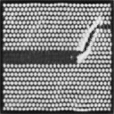
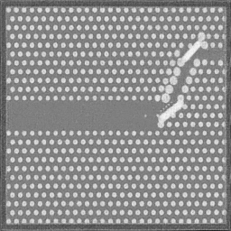

# photonic-crystal-gan

GAN-based generative pipeline for silicon photonic crystal image synthesis using PyTorch.

The goal is to generate photonic crystal structure images from random noise that are close enough to real Lumerical FDTD simulation outputs to be useful — generated images are passed to a Lumerical FDTD simulator where light transmission efficiency is evaluated. Structures clearing a >=75% accuracy threshold are reinjected into the training dataset to iteratively improve generation quality, with a target of 80%+.

The dataset is 34 custom Lumerical FDTD simulation images. This is a hard constraint — standard GAN training assumes thousands of images. Every architectural and training decision in this repo is a direct response to that constraint.

---

## Architecture Progression

Each stage was motivated by a specific diagnosed failure mode in the previous one. This is not a linear tutorial — it is a record of what actually happened.

| Stage | Folder | Architecture | Key Result |
|---|---|---|---|
| 1 | `Vanilla_GAN_Photonic_Crystal` | Fully connected GAN | Mode collapse by epoch 300. Loss D ~0.005, Loss G ~8.5. Expected — FC layers destroy spatial structure. |
| 2 | `DCGAN_STAGE_1` | DCGAN (paper-spec, 20×20) | Partial mode collapse. Binary output collapsed to single structure. Blurry continuous output. 20×20 resolution too low for structural fidelity. |
| 3 | `STABILIZED_DCGAN` | DCGAN with stabilisation techniques | Nash equilibrium (~0.693) achieved. Periodic hole lattice and waveguide defect channel topology learned. Blurry and low contrast — DCGAN's distribution-matching ceiling. |
| 4 | `V0_WGAN-GP` | WGAN-GP (baseline config) | Significantly higher contrast than DCGAN. Wasserstein loss improved sharpness immediately. Noisy output — preprocessing and config not yet tuned. |
| 5 | `V3_WGAN-GP` | WGAN-GP (tuned, 256×256) | Sharpest output so far. Clean periodic lattice, distinct hole geometry, waveguide defect channel clearly visible. Research ongoing. |

---

## Current State

Active research. V3 WGAN-GP is the current best result. The pipeline is being tuned further with the goal of producing outputs that pass the >=75% Lumerical FDTD transmission efficiency threshold consistently.

---

## Folder Structure

```
photonic-crystal-gan/
├── Vanilla_GAN_Photonic_Crystal/   # Stage 1 — FC GAN baseline
├── DCGAN_STAGE_1/                  # Stage 2 — DCGAN, paper-spec 20×20
├── STABILIZED_DCGAN/               # Stage 3 — stabilised DCGAN, 128×128
├── V0_WGAN-GP/                     # Stage 4 — WGAN-GP baseline
└── V3_WGAN-GP/                     # Stage 5 — WGAN-GP tuned, 256×256 (current best)
```

---

## Dataset

34 grayscale photonic crystal images from Lumerical FDTD simulations (custom, not publicly available). Resized and normalized to [-1, 1] for training. Images show periodic silicon-air hole lattice structures with a waveguide defect channel.

---

## Stack

Python, PyTorch, torchvision, OpenCV, TensorBoard, Matplotlib, PIL

---

## Visual Progression

### Stabilized DCGAN — 128×128


Topology learned. Periodic lattice and waveguide defect channel visible. Blurry and low contrast — DCGAN's ceiling with 34 images.

---

### V0 WGAN-GP — 128×128


Higher contrast than DCGAN immediately. Holes more distinct. Noisy — preprocessing and hyperparameters not yet tuned.

---

### V3 WGAN-GP — 256×256


Sharpest result. Clean periodic lattice, distinct circular holes, waveguide defect channel clearly visible. Closest to real dataset structure so far.
